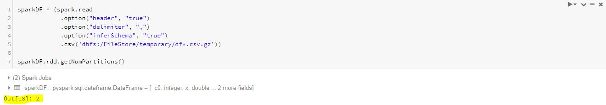

# Embarrassingly Parallel Model Training on Spark — Pandas UDF

Spark is one of the most popular tool to perform map-reduce tasks efficiently on large scale distributed data-sets. Additionally, Spark comes with MLlib package to perform Machine Learning on distributed data. On the flip side Python has very mature libraries: Numpy, Pandas, Scikit-Learn, etc. to perform data analysis and machine learning.
Spark’s native ML library though powerful generally lack in features. Python’s libraries usually provide more options to tinker with model parameters, resulting in better tuned models. However, Python is bound on single compute machine and one contiguous block of memory, which makes it infeasible to be used for training on large scale distributed data-set.

## Pandas — UDF (Get best of both worlds)
Pyspark performs computation through following data-flow:


We trigger our spark-context program on Master(“Local” in image here) node. The Spark program is executed on JVMs. Whenever during execution of code Spark encounters Python functions JVMs starts Python processes on working clusters and Python takes on the assigned task. Necessary data required for computation is pickled to Python and results are pickled back to JVM. Below is schematic data-flow for Pandas UDFs.


Pandas-UDF have similar data-flow. Additionally, to make the process more performance efficient “Arrow” (Apache Arrow is a cross-language development platform for in-memory data.) is used. Arrow allows data transfer from JVMs to Python processes in vectorized form, resulting in better performance in Python processes.
There is ample of reference material available for data munging, data manipulation, grouped data aggregation and model prediction/execution using Pandas UDFs. This tutorial serves the purpose of providing a guide to perform “Embarrassingly Parallel Model Training” using Pandas UDF.

### Requirements
Spark cluster (Databricks free community edition can be used)
Python Libraries: Numpy, Pandas, Scikit-Learn, and Joblib
*I have used Databricks environment for this tutorial
### 1. Create Directory to store required files
To operate on Databricks File System we use dbutils commands. Create a temporary folder in your DBFS.

`dbutils.fs.mkdirs("dbfs:/FileStore/temporary")`

This creates a “temporary” directory in “dbfs:/FileStore”
### 2. Import required Libraries
```python
import joblib # To Pickel Trained model file 
import numpy as np # To create random data
import pandas as pd # To operate on data in Python Process
from sklearn.linear_model import LinearRegression # To train Linear Regression models

from pyspark.sql.functions import pandas_udf, PandasUDFType # Pandas UDF functions to call Python processes from spark
from pyspark.sql.types import DoubleType, StringType, ArrayType # Data types to capture reurn at Spark End
```

### 3. Create dummy data for training
We created two data-sets df1 and df2 to train models in parallel.
df1: Y = 2.5 X + random noise
df2: Y = 3.0 X + random noise
We are saving the data-sets in temporary folder from step 1 in zipped format. Zipped files are read in Saprk in one single partition. We are using this feature to keep different data-sets in separate partition, so we can train individual models on each of them.

```python
df1 = pd.DataFrame({'x': np.random.normal(size=100)})
df1['y'] = df1['x']*2.5 + np.random.normal(scale=0.5, size=100) # DF1 is dummy Linear data Y = 2.5*x + random noise of 100 datapoints
df1['name'] = 'df1'
df1.to_csv('df1.csv')

# Zip the files (Zipped files are read in its own single partion in Spark)
%sh
gzip -f "df1.csv"

# Move the data set temporary folder we created in step 1
dbutils.fs.mv("file:/databricks/driver/df1.csv.gz", "dbfs:/FileStore/temporary/df1.csv.gz")

# Creating one more similar dataset to perform model training in parallel with first dataset
df2 = pd.DataFrame({'x': np.random.normal(size=100)})
df2['y'] = df2['x']*3.0 + np.random.normal(scale=0.3, size=100) # DF2 is dummy Linear data Y = 3.0*x + random noise of 100 datapoints
df2['name'] = 'df2'
df2.to_csv('df2.csv')

%sh
gzip -f "df2.csv"

dbutils.fs.mv("file:/databricks/driver/df2.csv.gz", "dbfs:/FileStore/temporary/df2.csv.gz")
```


### 4. Read files as Spark DataFrame

```python
sparkDF = (spark.read
            .option("header", "true")
            .option("delimiter", ",")
            .option("inferSchema", "true") 
            .csv('dbfs:/FileStore/temporary/df*.csv.gz'))

sparkDF.rdd.getNumPartitions()
```


As files are in zipped format we get one partition for each file. Resulting in total two partitions of SparkDF, instead of default 8. This facilitates in keeping all the data in one worker node and one contiguous memory. Therefore, Machine Learning model can easily be trained using Python libraries on each partition to produce individual models.
### 5. Pandas UDF function for Model Training
```python
@pandas_udf(returnType=DoubleType())
def train_lm_pandas_udf(*cols):
    df = pd.concat(cols, axis=1) # Create pandas dataframe using input Spark DataFrame columns
    df.columns = ['x', 'y', 'name']
    modelUDF = LinearRegression() # Scikit-Learn Linear Regression 
    modelUDF.fit(pd.DataFrame(df['x']),df['y']) # Fit Scikit-Learn Linear Regression Model
    sig = df.loc[0,'name'] # Unique Identiter for model files, obtained from one of the columns in dataset
    joblib.dump(modelUDF, 'modelUDF{signature}.joblib'.format(signature=sig)) # Pickel Thetrained model file
    return pd.Series(modelUDF.predict(pd.DataFrame(df['x']))) # Returns Predicted values on training data
```

The UDF function here trains Scikit-Learn model Spark Data-frame partitions and pickle individual models to “file:/databricks/driver”. Unfortunately, we cannot pickle directly to “FileStore” in Databricks environment. But, can later move the model files to “FileStore”!
### 6. Train the models
Create “sparkDF2” which call “train_lm_pandas_udf” on “sparkDF”, created in step 4.
```
column_names = ['x', 'y', 'name']
sparkDF2 = sparkDF.select(train_lm_pandas_udf(*column_names).alias("TrainPrediction"))

sparkDF2.rdd.count() # Action is required to initate model training.
```

To initiate model training we need to trigger action on sparkDF2. Make sure the action used to trigger touches all partitions otherwise training will only happen for partitions touched.


As evident form Job DAG, the columns are navigated to Python using Arrow, to complete the model training. Additionally, we can see that there is no Shuffle Write/Read due to Embarrassingly parallel nature of the job.


Above displays event timeline for stages of execution of spark job. Parallel execution reduces the time to train by 1/2! (which can be improved by improving on size of your cluster and training more models).
### 7. Testing the models
As we have trained models on dummy data, we have good idea of what model coefficients should be. So we can simply load model files and see if model coefficients make sense.


```python
modeldf1 = joblib.load('modelUDFdf1.joblib')
modeldf2 = joblib.load('modelUDFdf2.joblib')
```


Evident from results above. Model coefficient for df1 is 2.55, which is close to our equation for df1: Y = 2.5 X + random noise. And for df2 it is 2.93 consistent with df2: Y = 3.0 X + random noise.

Review one use case of parallel model training here: https://medium.com/@edmauryaishu/lets-read-customer-reviews-actually-make-machine-do-it-fd5465ca7b7f

